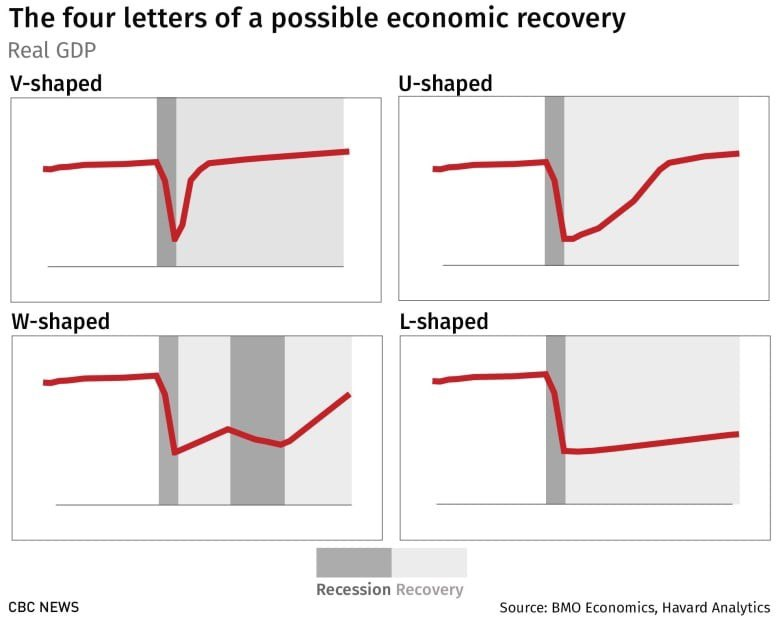

# İqtisadi böhranlar və ondan çıxış yolu

İqtisadi böhranlar xarici iqtisadçılar tərəfindən əsasən V, U, W və L formalı böhran kimi qruplaşdırılır. V formalı böhran hərfin formasından da göründüyü kimi kəskin düşüşlərdən sonra qısa müddətdə iqtisadiyyatın bərpası prosesinə deyilir. U formalı böhran baş verəndə iqtisadiyyat böhrandan sonra tədricən bərpa olur və buna görə nisbətən daha çox vaxt tələb olunur. W formalı böhran zamanı isə iqtisadiyyat qısa bərpa prosesindən sonra yenə geriləyir. Daha sonra isə tam bərpa prosesi başlayır. İqtisadçıların ən qorxduğu forma L formalı böhrandır. Belə ki, hərfin formasında olduğu kimi iqtisadiyyat böhrana girir və uzun müddət bərpa prosesi demək olar ki, getmir. Buna depressiya deyilir. 1929-39-cu illərdə ABŞ-da bu tipli böhran baş vermiş və nəticədə işsizlik 25 faiz (1933) olmuşdur. Bu isə ölkədəki hər 4 adamdan 1-nin işsiz olması deməkdir.

_İqtiasdi bərpanın dörd mümkün forması_

Məlumat üçün qeyd edək ki, mövcud pandemiya səbəbindən baş verən böhranın və ondan sonrakı bərpa prosesinin bir çox ekspert tərəfindən U və W formalı olacağı deyilir.
